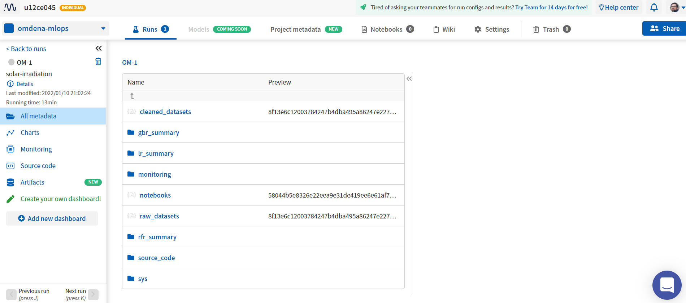
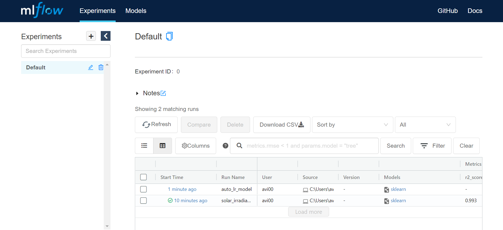
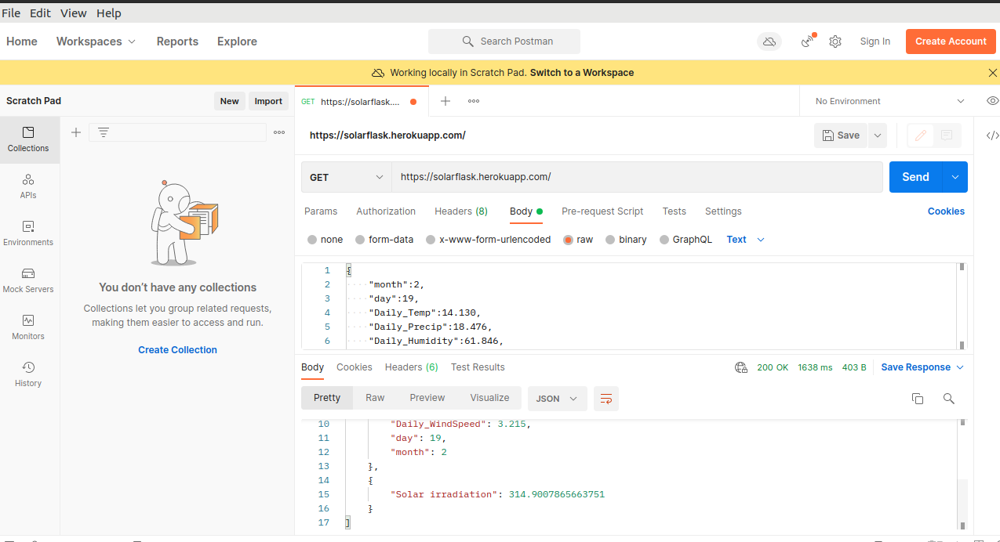

## Solar App

Calculate Solar radiation of regions where data is provided by [Solar Cast Website](https://solcast.com/). A Flask App is created where already tested model are used to calculate the given input values. Here Random Forest Regressor model is used because of good accuracy and there is also other model where it done a End to End Machine Learning.

Steps to follow this Lecture:-
- Data Cleaning where feature engineering selects the important column and done a random split for training and testing.
- Model Analysis and exploration of the  Radiation Dataset
- Train and Evaluate the model in [data_exploration_and_visualization](notebooks/data_exploration_and_visualization.ipynb)
- Model Tracking and deploying for model performance in [neptune as well as mlflow](notebooks/data_validation.ipynb)
- Completing a MLOps procedure, a model is deployed on heroku so that other community can access after the local deploymnet is successful.

--------------------------------
```
Neptune Tracking
```


```
Mlflow Tracking
```


```
And Heroku Deployment 
```

