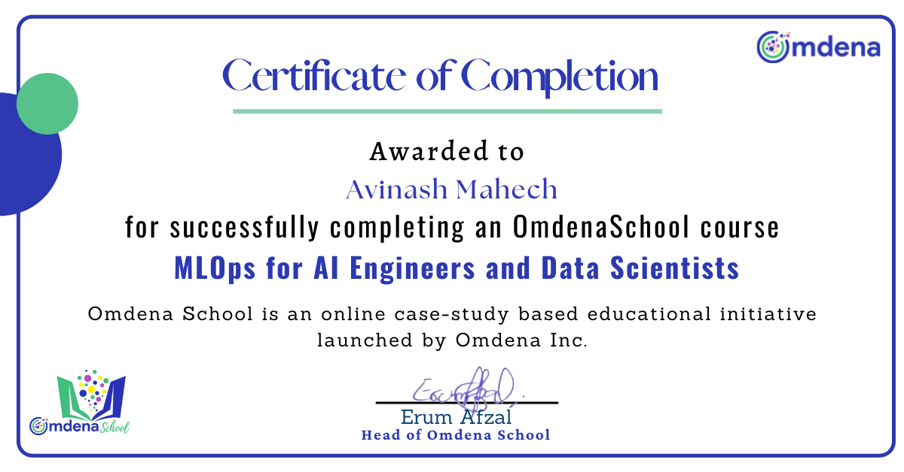

# MLOps for AI Engineers and Data Science


Lecture Content

1. Introduction to MLOps
2. Containers for ML Deployment
3. Leveraging Cloud Computing for MLOps
4. Monitoring and Automation
5. An Introduction to CI/CD for automated model deployment

[Omdena MLOps Course Link](https://omdena.com/course/mlops-for-ai-engineers-and-data-scientists/) 
----------------------
```

```

